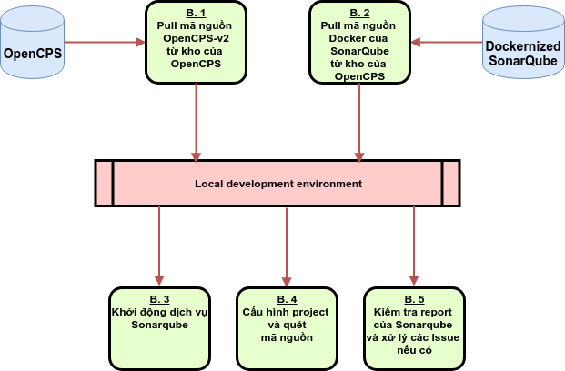

# Dockernized Sonarqube  for OpenCPS  - Kiểm tra an toàn mã nguồn OpenCPS với Sonarqube
## Cài đặt
* Cài đặt [Docker](https://docs.docker.com/install/)
* Cài đặt [Docker Compose](https://docs.docker.com/compose/install/)
## Quick start
* Chạy lệnh: ./demo.sh
* Mở Browser, vào URL: http://localhost:9000
* Chọn Project [demo](http://localhost:9000/dashboard?id=demo)
## Kiểm tra an toàn mã nguồn OpenCPS
**Yêu cầu cấu hình máy phát triển: RAM >=8GB, HDD>=20GB**

 
 
1. B1: Pull mã nguồn project OpenCPS-v2 từ GitHub:
* git clone https://github.com/VietOpenCPS/opencps-v2.git
* Thư mục project: opencps-v2
2. B2: Pull bản docker của SonarQube từ GitHub:
* git clone https://github.com/latuannetnam/opencps-sonarqube.git
* Thư mục docker: opencps-sonarqube
3. B3: Khởi động dịch vụ SonarQube:
* cd opencps-sonarqube
* ./start.sh
4. B4: Cấu hình project và quét mã nguồn:
* cd opencps-v2
* nano build.gradle
 > plugins {
 >  id "org.sonarqube" version "2.6"
 > }
* Cài đặt Java 8 nếu cần thiết
* ./gradlew buildService deploy
* ./gradlew sonarqube  -Dorg.gradle.jvmargs=-Xmx4096m -Dsonar.host.url=http://localhost:9000
5. B5: Kiểm tra report của Sonaqube:
* URL: http://localhost:9000/dashboard?id=opencps-v2
* Bấm vào từng Issue để mô tả chi tiết và cách khắc phục
